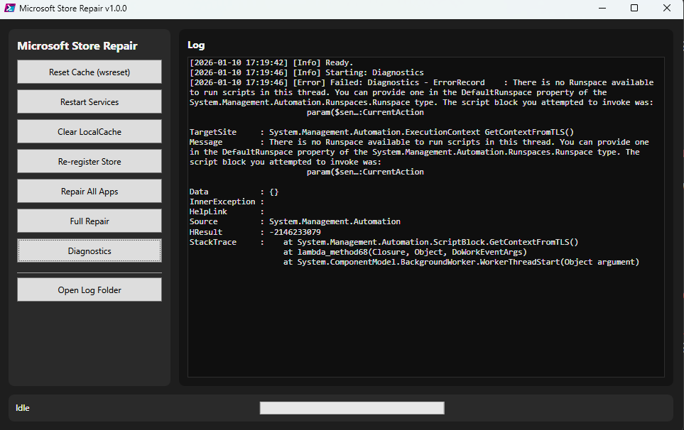

# 🛠️ Microsoft Store Repair

> **A modern WPF tool to fix Microsoft Store issues on Windows 10/11 — built by Gimmy & Tiger.**

[](https://github.com/gmy77/msstore-repair-wpf/releases/latest)
[](LICENSE)
[]()
[]()
[]()

---

## ✨ What it does

Microsoft Store Repair is a PowerShell script with a clean WPF GUI that automates every common fix for Store update and download issues — no manual command hunting, no registry digging. Open it, click what you need, watch the colored log.



---

## 🚀 Features

| Feature | Description |
| --- | --- |
| ⚡ Reset Cache | Runs `wsreset.exe` with a 60-second timeout guard |
| 🔄 Restart Services | Restarts 5 Store-related Windows services with status tracking |
| 🗑️ Clear LocalCache | Wipes the Store LocalCache folder (closes Store processes first) |
| 📦 Re-register Store | Re-registers all `Microsoft.WindowsStore` packages for all users |
| 🔧 Repair All Apps | Re-registers every installed UWP app with live progress |
| 🚀 Full Repair | Runs all 5 steps above in sequence, with cancel support |
| 🔍 Diagnostics | Shows service status, Store version, cache size, running processes |
| ✖ Cancel | Abort any running operation cleanly between steps |
| 🌈 Color-coded log | Green = success, amber = warning, red = error — at a glance |
| 🔤 Font scaling | Slider to resize the entire UI (10–20px), preference saved automatically |
| 📂 Log rotation | Daily log files in `logs\msstore-repair_YYYY-MM-DD.log` |

---

## 📋 Requirements

- Windows 10 or Windows 11
- **PowerShell 5.1** (recommended) or PowerShell 7+
- **Administrator privileges** (the tool auto-prompts to elevate)

> ⚠️ If you're on PowerShell 7 and Appx cmdlets are missing, the tool will warn you and skip those steps. Use Windows PowerShell 5.1 for full functionality, or run:
> ```powershell
> Import-Module Appx -UseWindowsPowerShell
> ```

---

## ▶️ Quick Start

1. **Download** the latest release ZIP from the [Releases page](https://github.com/m121752332/msstore-repair-tool/releases) and extract it — or clone the repo:

   ```powershell
   git clone https://github.com/m121752332/msstore-repair-tool.git
   cd msstore-repair-tool
   ```

2. **Run** the script:

   ```powershell
   Set-ExecutionPolicy -Scope Process -ExecutionPolicy Bypass
   .\MSStoreRepair.ps1
   ```

3. If not already elevated, the tool will ask to **relaunch as Administrator** — click Yes.

4. Use the buttons on the left panel. The log panel on the right shows everything in real time.

---

## 🖥️ Interface

```plain
┌─────────────────────────────────────────────────────────────────┐
│  🛠️ Microsoft Store Repair          [v3.0.0]  [✔ Admin]         │
├──────────────────┬──────────────────────────────────────────────┤
│  OPERATIONS      │  Activity Log                  ☑ Auto-scroll │
│                  │                                              │
│  ⚡ Reset Cache   │  [18:57:47] ✔ Ready.                         │
│  🔄 Restart Svc  │  [18:57:48] ✔ Completed: Diagnostics (2.1s) │
│  🗑️ Clear Cache  │  [18:57:49] ⚠ Cache size: 240 MB            │
│  📦 Re-register  │                                              │
│  🔧 Repair Apps  │                                              │
│  ── ── ── ── ──  │                                              │
│  🚀 Full Repair  │                                              │
│  🔍 Diagnostics  │                                              │
│  ── ── ── ── ──  │                                              │
│  ✖ Cancel        │                                              │
│  📂 Open Logs    │                                              │
│  🧹 Clear Log    │                                2 entries     │
├──────────────────┴──────────────────────────────────────────────┤
│  ● Ready          🔤 A ──●────── A  14px        [████████░░░]   │
└─────────────────────────────────────────────────────────────────┘
```

---

## 📁 File Structure

```plain
msstore-repair-tool/
├── MSStoreRepair.ps1     ← main script (single file, no dependencies)
├── config.json           ← auto-created on first run (saves font size etc.)
├── logs/
│   └── msstore-repair_YYYY-MM-DD.log
├── LICENSE
├── CHANGELOG.md
└── README.md
```

---

## 📝 Log Format

```plain
[2026-05-27 18:57:47] [Info]    Starting: Full Repair
[2026-05-27 18:57:47] [Info]    Launching wsreset.exe...
[2026-05-27 18:57:52] [Success] Cache reset completed
[2026-05-27 18:57:52] [Warning] Service not found: WSService
[2026-05-27 18:57:55] [Success] Completed: Full Repair  (8.3s)
```

---

## 🔧 Troubleshooting

| Problem | Solution |
| --- | --- |
| `Appx cmdlets not available` | Use Windows PowerShell 5.1, not PowerShell 7 |
| `wsreset.exe timeout` | The tool kills it after 60s automatically and continues |
| `Access Denied` on cache clear | Make sure you're running as Administrator |
| Script won't start | Run `Set-ExecutionPolicy -Scope Process -ExecutionPolicy Bypass` first |
| Font too small | Use the slider in the bottom bar — preference is saved automatically |

---

## 📜 Changelog

See [CHANGELOG.md](CHANGELOG.md) for the full version history.

**Latest — v3.0.0:**

- Complete UI redesign with Windows 11 accent colors and custom button styles
- Color-coded RichTextBox log (green / amber / red per level)
- Font size slider with persistent preference saved to `config.json`
- Cancel button to abort running operations
- Confirmation dialogs before destructive operations
- Tooltips on every button
- Live elapsed time counter in the status bar
- Admin badge in the header

---

## 📄 License

MIT License — see [LICENSE](LICENSE) for full text.

```plain
Copyright (c) 2026 Gimmy Pignolo & Tiger
```

Free to use, modify, and distribute. A mention is always appreciated. 🙂

---

<div align="center">
**Made with ❤️ by Gimmy & Tiger**
*Gimmy Pignolo · Tiger · Windows 11 · PowerShell · WPF*
</div>
